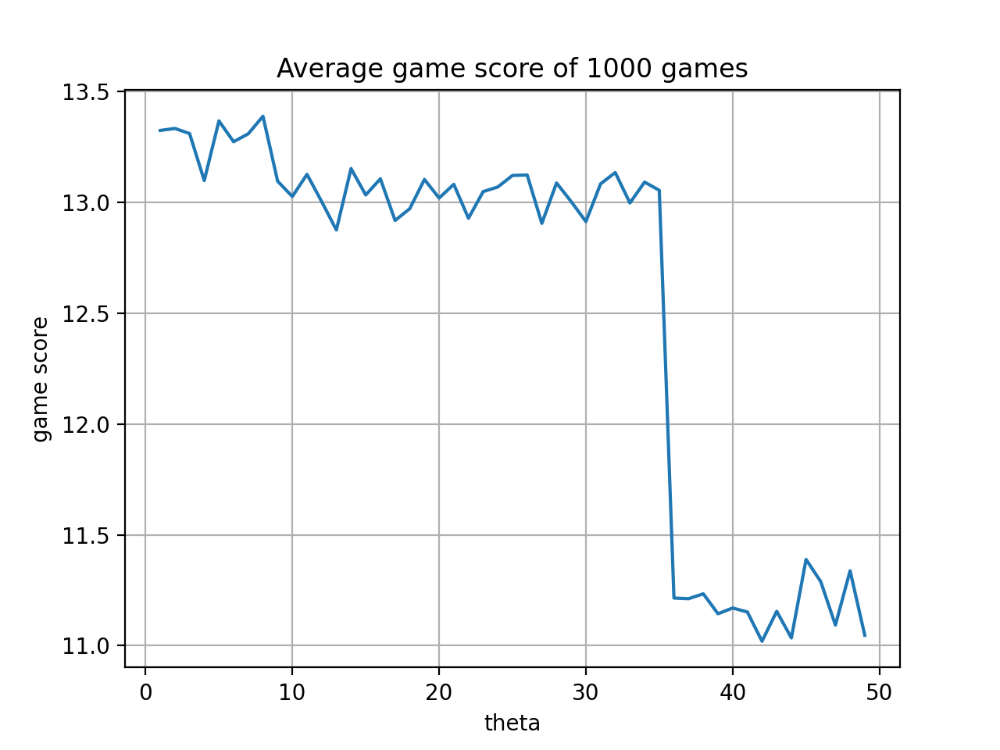

# Solving a game of dice using value iteration

REF：https://github.com/andrejlukic/dicegame-solver

## Introduction

The goal of this work is to write an agent that is able to play a game of dice and score as many points as possible. The rules of the game are as follows:

* Player starts with 0 points and rolls three fair six-sided dice. This can also be extended to any number of modified dice, e.g. three three-sided dice
* After each roll the player can decide to either stick or reroll:
    * If she sticks the values shown are accepted. If two or more dice show the same values, then all of them are flipped upside down: 1 becomes 6, 2 becomes 5, 3 becomes 4, and vice versa. The total is then added to player's points and this is the final score.
    * If she rerolls the dice she may choose to hold any combination of the dice on the current value shown. Rerolling costs 1 point so the score may end up being negative.

 
Image:  Diacritica [2] (Source: Wikipedia [1])

## commit guidelines

REF: [Commit message 和 Change log 编写指南 - 阮一峰](https://www.ruanyifeng.com/blog/2016/01/commit_message_change_log.html)

```
<type>(<scope>): <subject> # scope 选填，type 和 subject 必填。简单说明，不超过50个字
# 空一行
[optional body] # body 选填，用于填写更详细的描述
# 空一行
<footer> # 选填
```

> *# 主要type*
> 
> feat：新功能（feature）。
> 
> fix：修复bug，可以是QA发现的BUG，也可以是研发自己发现的BUG。
>
> 
> 
> *# 特殊type*
> 
> docs：文档（documentation）。
> 
> style：格式（不影响代码运行的变动）。
> 
> refactor：重构（即不是新增功能，也不是修改bug的代码变动）。
> 
> perf：优化相关，比如提升性能、体验。
> 
> test：增加测试。
> 
> chore：构建过程或辅助工具的变动。

## Method

Several iterations of the algorithm were implemented and the approach that proved to be the fastest and at the same time most successful is a value iteration approach that calculates an optimal policy for the agent using the Bellman optimality equation ([3]). It works for normal fair dice as well as modified ones with arbitrary number of sides. 

In the basic example three fair dice are used (each with six sides). Each roll ends in one of the 56 possible game states. Since the dice is unbiased all states are equally probable. All 56 of them are listed here (D1, D2 and D3 are the three dices being rolled):

| D1 | D2 | D3 | D1 | D2 | D3 | D1 | D2 | D3 | D1 | D2 | D3 | D1 | D2 | D3 | D1 | D2 | D3 |
|----|----|----|----|----|----|----|----|----|----|----|----|----|----|----|----|----|----|
| 1  | 1  | 1  | 2  | 2  | 2  | 3  | 3  | 3  | 4  | 4  | 4  | 5  | 5  | 5  | 6  | 6  | 6  |
| 1  | 1  | 2  | 2  | 2  | 3  | 3  | 3  | 4  | 4  | 4  | 5  | 5  | 5  | 6  |    |    |    |
| 1  | 1  | 3  | 2  | 2  | 4  | 3  | 3  | 5  | 4  | 4  | 6  | 5  | 6  | 6  |    |    |    |
| 1  | 1  | 4  | 2  | 2  | 5  | 3  | 3  | 6  | 4  | 5  | 5  |    |    |    |    |    |    |
| 1  | 1  | 5  | 2  | 2  | 6  | 3  | 4  | 4  | 4  | 5  | 6  |    |    |    |    |    |    |
| 1  | 1  | 6  | 2  | 3  | 3  | 3  | 4  | 5  | 4  | 6  | 6  |    |    |    |    |    |    |
| 1  | 2  | 2  | 2  | 3  | 4  | 3  | 4  | 6  |    |    |    |    |    |    |    |    |    |
| 1  | 2  | 3  | 2  | 3  | 5  | 3  | 5  | 5  |    |    |    |    |    |    |    |    |    |
| 1  | 2  | 4  | 2  | 3  | 6  | 3  | 5  | 6  |    |    |    |    |    |    |    |    |    |
| 1  | 2  | 5  | 2  | 4  | 4  | 3  | 6  | 6  |    |    |    |    |    |    |    |    |    |
| 1  | 2  | 6  | 2  | 4  | 5  |    |    |    |    |    |    |    |    |    |    |    |    |
| 1  | 3  | 3  | 2  | 4  | 6  |    |    |    |    |    |    |    |    |    |    |    |    |
| 1  | 3  | 4  | 2  | 5  | 5  |    |    |    |    |    |    |    |    |    |    |    |    |
| 1  | 3  | 5  | 2  | 5  | 6  |    |    |    |    |    |    |    |    |    |    |    |    |
| 1  | 3  | 6  | 2  | 6  | 6  |    |    |    |    |    |    |    |    |    |    |    |    |
| 1  | 4  | 4  |    |    |    |    |    |    |    |    |    |    |    |    |    |    |    |
| 1  | 4  | 5  |    |    |    |    |    |    |    |    |    |    |    |    |    |    |    |
| 1  | 4  | 6  |    |    |    |    |    |    |    |    |    |    |    |    |    |    |    |
| 1  | 5  | 5  |    |    |    |    |    |    |    |    |    |    |    |    |    |    |    |
| 1  | 5  | 6  |    |    |    |    |    |    |    |    |    |    |    |    |    |    |    |
| 1  | 6  | 6  |    |    |    |    |    |    |    |    |    |    |    |    |    |    |    |

The value iteration algorithm starts with assigning an initial value of zero to each of these states. Then it performs the update equation based on the Bellman optimality equation ([3]) to find the optimal values for each state along with an action that produces it. The optimal policy consisting of pairs (state, action) is then returned and used to play the game. 

The algorithm caches certain expensive computations in memory and converges relatively fast. It is able to run for any number of dices and any number of faces. As shown later in the results section the average score of the algorithm is around 13.3 for three fair dice with six faces, 4.3 for three fair dice with three faces and 29.2 for six fair dice with six faces.

### Important functions
The core of the code is the algorithm that performs value iteration to calculate the optimal policy. Since the optimal policy only depends on the dice configuration this can be performed once at the instantiation of the MyAgent class.

#### Calculating the optimal policy 
The optimal policy is calculated at the moment of MyAgent class instantiation. Each of possible 56 states starts with a value zero and is subsequently corrected as the algorithm progresses. The threshold theta has been tuned to offer a compromise between algorithm successfully converging and executing fast. For performance reasons the get_next_states method has been replaced with a faster version get_next_states_cached that stores the already calculated list of next states in memory for use in the subsequent iterations.

```{python}
def __init__(self, game, gamma = 0.96, theta = 0.1):

    super().__init__(game)

    # value iteration
    local_cache = {}
    v_arr = {}
    policy = {}
    for state in game.states:
        v_arr[state] = 0
        policy[state] = ()
    
    delta_max = theta + 1  # initialize to be over theta treshold
    while (delta_max >= theta):
        delta_max = 0
        for state in game.states:
            s_val = v_arr[state]
            max_action = 0
            for action in game.actions:
                s1_sum = 0            
                states, game_over, reward, probabilities = get_next_states_cached(game, local_cache, action, state)
                for s1, p1 in zip(states, probabilities):
                    if not game_over:
                        s1_sum += p1 * (reward + gamma * v_arr[s1])
                    else:
                        s1_sum += p1 * (reward + gamma * game.final_score(state))
                if s1_sum > max_action:
                    max_action = s1_sum
                    policy[state] = action
            v_arr[state] = max_action
            delta_max = max(delta_max, abs(s_val - v_arr[state]))
    
    self._policy = policy
```

Storing a list of next states in memory to avoid recalculating same list of next states repeatedly:

```{python}
def get_next_states_cached(game, cache, action, state):
    if (action, state) not in cache:
        cache[(action, state)] = game.get_next_states(action, state)
    return cache[(action, state)]
```
 
### Tuning hyper-parameters gamma / theta
Initially typical values of 0.9 and 0.01 were chosen for the parameters gamma and theta. Then a simple tuning has been done to determine whether their values could be optimised and for both a more suitable value was found. An average score of 10000 games was used as a metric. 

#### Theta
An initial setting for theta was 0.01 and it quickly became obvious that increasing theta will considerably improve performance while not notably reducing the success of the algorithm. How algorithm scored based on various theta settings can be observed on a picture (a table of measurements are included in the last section.):
 
 
 
 While increasing theta did not drastically affect the algorithm success it reduced execution time considerably:
 
 
 
 A value of 0.1 was finally chosen for theta as a compromise between speed of execution and algorithm success.
 
 #### Gamma
 An initial setting for gamma was 0.90 and the measurements showed that this was a reasonably good guess for this parameter. However the measurements also showed that this could be slightly improved by increasing it to 0.96. How algorithm scored based on various gamma settings can be observed on a picture (a table of measurements are included in the last section.):
 
  
 
 
 

## Results
Final success of the algorithm was measured by repeatedly playing batches of 1000 games. The resulting table shows a average scores and the time it took to calculate the average policy and play the batch of 1000 games.

### Average score and time for playing 10000 games

For a game of three dice with six sides these are the results:

| Score | Time (sec) |
|-------|------------|
| 13,29 | 0,43       |
| 13,33 | 0,42       |
| 13,38 | 0,42       |
| 13,29 | 0,42       |
| 13,37 | 0,42       |
| 13,39 | 0,41       |
| 13,29 | 0,42       |
| 13,36 | 0,42       |
| 13,3  | 0,42       |
| 13,32 | 0,41       |

An average score 13,33	and average time 0,42 seconds.

For a game of two dice with three sides these are the results:

| Score | Time (sec) |
|-------|------------|
| 4,24  | 0,09       |
| 4,26  | 0,09       |
| 4,24  | 0,09       |
| 4,24  | 0,09       |
| 4,22  | 0,09       |
| 4,26  | 0,09       |
| 4,2   | 0,09       |
| 4,28  | 0,09       |
| 4,28  | 0,09       |
| 4,23  | 0,09       |

An average score 4,25 and average time 0,09 seconds.

For a game of six dice with six sides the number of games played was reduced to a hundred in total. 

| Score | Time (sec) |
|-------|------------|
| 29,2  | 32,08      |

An average score of hundred games was 29,2 and time 32,08 seconds.

### Individual measurements
For transparency purposes all of the measurements are included here:

##### Running algorithm for various gamma values (score is an average of 10000 games)
| Gamma | Score  | Time  |
|-------|--------|-------|
| 0,880 | 12,7   | 0,952 |
| 0,882 | 12,687 | 0,754 |
| 0,884 | 12,737 | 0,75  |
| 0,886 | 12,638 | 0,842 |
| 0,888 | 12,646 | 0,844 |
| 0,890 | 12,749 | 0,844 |
| 0,892 | 12,876 | 0,842 |
| 0,894 | 12,822 | 0,85  |
| 0,896 | 12,764 | 0,853 |
| 0,898 | 12,857 | 0,842 |
| 0,900 | 12,815 | 0,842 |
| 0,902 | 12,73  | 0,845 |
| 0,904 | 12,829 | 0,848 |
| 0,906 | 12,898 | 0,851 |
| 0,908 | 13,142 | 0,852 |
| 0,910 | 12,947 | 0,853 |
| 0,912 | 12,953 | 0,856 |
| 0,914 | 12,891 | 0,86  |
| 0,916 | 13     | 0,949 |
| 0,918 | 12,97  | 0,954 |
| 0,920 | 12,94  | 0,951 |
| 0,922 | 12,975 | 0,948 |
| 0,924 | 12,95  | 0,949 |
| 0,926 | 12,982 | 0,945 |
| 0,928 | 13,077 | 0,954 |
| 0,930 | 13,089 | 0,952 |
| 0,932 | 13,037 | 0,951 |
| 0,934 | 12,948 | 0,95  |
| 0,936 | 13,009 | 0,952 |
| 0,938 | 13,154 | 0,969 |
| 0,940 | 13,181 | 1,056 |
| 0,942 | 13,22  | 1,064 |
| 0,944 | 13,36  | 1,066 |
| 0,946 | 13,279 | 1,085 |
| 0,948 | 13,202 | 1,073 |
| 0,950 | 13,475 | 1,056 |
| 0,952 | 13,347 | 1,069 |
| 0,954 | 13,332 | 1,067 |
| 0,956 | 13,399 | 1,066 |
| 0,958 | 13,357 | 1,172 |
| 0,960 | 13,438 | 1,172 |
| 0,962 | 13,275 | 1,172 |
| 0,964 | 13,454 | 1,166 |
| 0,966 | 13,378 | 1,166 |
| 0,968 | 13,451 | 1,173 |
| 0,970 | 13,13  | 1,18  |
| 0,972 | 13,3   | 1,175 |
| 0,974 | 13,384 | 1,179 |
| 0,976 | 13,45  | 1,27  |
| 0,978 | 13,169 | 1,283 |
| 0,980 | 13,302 | 1,287 |
| 0,982 | 13,217 | 1,322 |
| 0,984 | 13,277 | 1,3   |
| 0,986 | 12,971 | 1,31  |
| 0,988 | 13,181 | 1,309 |
| 0,990 | 13,129 | 1,304 |
| 0,992 | 13,209 | 1,392 |
| 0,994 | 12,985 | 1,41  |
| 0,996 | 12,873 | 1,415 |
| 0,998 | 13,027 | 1,408 |

##### Running algorithm for various theta values (score is an average of 10000 games)

| Theta | Score  | Time  |
|-------|--------|-------|
| 0,01  | 13,292 | 1,105 |
| 0,03  | 13,286 | 1,002 |
| 0,05  | 13,226 | 0,906 |
| 0,07  | 13,476 | 0,907 |
| 0,09  | 13,305 | 0,793 |
| 0,11  | 13,225 | 0,805 |
| 0,13  | 13,206 | 0,803 |
| 0,15  | 13,323 | 0,8   |
| 0,17  | 13,399 | 0,789 |
| 0,19  | 13,269 | 0,783 |
| 0,21  | 13,337 | 0,693 |
| 0,23  | 13,118 | 0,707 |
| 0,25  | 13,236 | 0,7   |
| 0,27  | 13,32  | 0,694 |
| 0,29  | 13,281 | 0,718 |
| 0,31  | 13,258 | 0,73  |
| 0,33  | 13,151 | 0,726 |
| 0,35  | 13,406 | 0,716 |
| 0,37  | 13,342 | 0,707 |
| 0,39  | 13,315 | 0,709 |
| 0,41  | 13,303 | 0,699 |
| 0,43  | 13,296 | 0,71  |
| 0,45  | 13,26  | 0,609 |
| 0,47  | 13,125 | 0,637 |
| 0,49  | 13,317 | 0,62  |
| 0,51  | 13,33  | 0,603 |
| 0,53  | 13,424 | 0,599 |
| 0,55  | 13,328 | 0,636 |
| 0,57  | 13,305 | 0,643 |
| 0,59  | 13,374 | 0,615 |
| 0,61  | 13,311 | 0,618 |
| 0,63  | 13,199 | 0,636 |
| 0,65  | 13,371 | 0,633 |
| 0,67  | 13,27  | 0,653 |
| 0,69  | 13,24  | 0,632 |
| 0,71  | 13,278 | 0,629 |
| 0,73  | 13,392 | 0,619 |
| 0,75  | 13,284 | 0,626 |
| 0,77  | 13,352 | 0,641 |
| 0,79  | 13,426 | 0,625 |
| 0,81  | 13,332 | 0,634 |
| 0,83  | 13,338 | 0,613 |
| 0,85  | 13,138 | 0,644 |
| 0,87  | 13,338 | 0,661 |
| 0,89  | 13,169 | 0,618 |
| 0,91  | 13,28  | 0,642 |
| 0,93  | 13,341 | 0,647 |
| 0,95  | 13,227 | 0,642 |
| 0,97  | 13,309 | 0,612 |
| 0,99  | 13,416 | 0,619 |
| 1,01  | 13,302 | 0,621 |
| 1,03  | 13,197 | 0,755 |
| 1,05  | 13,464 | 0,541 |
| 1,07  | 13,359 | 0,527 |
| 1,09  | 13,229 | 0,523 |
| 1,11  | 13,452 | 0,507 |
| 1,13  | 13,401 | 0,526 |
| 1,15  | 13,188 | 0,54  |
| 1,17  | 13,289 | 0,532 |
| 1,19  | 13,178 | 0,523 |
| 1,21  | 13,325 | 0,536 |
| 1,23  | 13,346 | 0,534 |
| 1,25  | 13,31  | 0,538 |
| 1,27  | 13,301 | 0,537 |
| 1,29  | 13,341 | 0,528 |
| 1,31  | 13,263 | 0,557 |
| 1,33  | 13,434 | 0,526 |
| 1,35  | 13,345 | 0,514 |
| 1,37  | 13,368 | 0,512 |
| 1,39  | 13,286 | 0,542 |
| 1,41  | 13,337 | 0,537 |
| 1,43  | 13,522 | 0,521 |
| 1,45  | 13,335 | 0,521 |
| 1,47  | 13,321 | 0,509 |
| 1,49  | 13,257 | 0,513 |
| 1,51  | 13,291 | 0,522 |
| 1,53  | 13,322 | 0,526 |
| 1,55  | 13,227 | 0,533 |
| 1,57  | 13,282 | 0,548 |
| 1,59  | 13,466 | 0,55  |
| 1,61  | 13,401 | 0,537 |
| 1,63  | 13,349 | 0,522 |
| 1,65  | 13,338 | 0,544 |
| 1,67  | 13,317 | 0,536 |
| 1,69  | 13,342 | 0,53  |
| 1,71  | 13,496 | 0,536 |
| 1,73  | 13,432 | 0,533 |
| 1,75  | 13,228 | 0,535 |
| 1,77  | 13,433 | 0,533 |
| 1,79  | 13,357 | 0,546 |
| 1,81  | 13,274 | 0,545 |
| 1,83  | 13,205 | 0,538 |
| 1,85  | 13,344 | 0,531 |
| 1,87  | 13,322 | 0,536 |
| 1,89  | 13,39  | 0,529 |
| 1,91  | 13,131 | 0,538 |
| 1,93  | 13,306 | 0,526 |
| 1,95  | 13,229 | 0,537 |
| 1,97  | 13,331 | 0,535 |
| 1,99  | 13,275 | 0,531 |
| 2,01  | 13,268 | 0,535 |
| 2,03  | 13,331 | 0,539 |
| 2,05  | 13,216 | 0,531 |
| 2,07  | 13,34  | 0,531 |
| 2,09  | 13,255 | 0,519 |
| 2,11  | 13,289 | 0,513 |
| 2,13  | 13,279 | 0,54  |
| 2,15  | 13,294 | 0,551 |
| 2,17  | 13,212 | 0,551 |
| 2,19  | 13,247 | 0,538 |
| 2,21  | 13,316 | 0,536 |
| 2,23  | 13,29  | 0,523 |
| 2,25  | 13,224 | 0,535 |
| 2,27  | 13,406 | 0,517 |
| 2,29  | 13,306 | 0,517 |
| 2,31  | 13,375 | 0,511 |
| 2,33  | 13,32  | 0,516 |
| 2,35  | 13,352 | 0,552 |
| 2,37  | 13,205 | 0,523 |
| 2,39  | 13,37  | 0,534 |
| 2,41  | 13,218 | 0,54  |
| 2,43  | 13,242 | 0,538 |
| 2,45  | 13,375 | 0,54  |
| 2,47  | 13,298 | 0,549 |
| 2,49  | 13,309 | 0,527 |
| 2,51  | 13,308 | 0,53  |
| 2,53  | 13,397 | 0,525 |
| 2,55  | 13,163 | 0,539 |
| 2,57  | 13,218 | 0,525 |
| 2,59  | 13,383 | 0,52  |
| 2,61  | 13,443 | 0,524 |
| 2,63  | 13,368 | 0,532 |
| 2,65  | 13,194 | 0,452 |
| 2,67  | 13,342 | 0,439 |
| 2,69  | 13,381 | 0,435 |
| 2,71  | 13,251 | 0,436 |
| 2,73  | 13,377 | 0,456 |
| 2,75  | 13,203 | 0,441 |
| 2,77  | 13,209 | 0,435 |
| 2,79  | 13,16  | 0,433 |
| 2,81  | 13,247 | 0,44  |
| 2,83  | 13,392 | 0,428 |
| 2,85  | 13,312 | 0,421 |
| 2,87  | 13,218 | 0,414 |
| 2,89  | 13,299 | 0,427 |
| 2,91  | 13,197 | 0,445 |
| 2,93  | 13,212 | 0,457 |
| 2,95  | 13,383 | 0,435 |
| 2,97  | 13,262 | 0,458 |
| 2,99  | 13,27  | 0,463 |
| 3,01  | 13,266 | 0,448 |
| 3,03  | 13,354 | 0,447 |
| 3,05  | 13,321 | 0,448 |
| 3,07  | 13,31  | 0,447 |
| 3,09  | 13,298 | 0,447 |
| 3,11  | 13,238 | 0,451 |
| 3,13  | 13,104 | 0,455 |
| 3,15  | 13,282 | 0,43  |
| 3,17  | 13,258 | 0,437 |
| 3,19  | 13,356 | 0,438 |
| 3,21  | 13,36  | 0,426 |
| 3,23  | 13,409 | 0,42  |
| 3,25  | 13,399 | 0,419 |
| 3,27  | 13,15  | 0,424 |
| 3,29  | 13,328 | 0,424 |
| 3,31  | 13,39  | 0,417 |
| 3,33  | 13,25  | 0,42  |
| 3,35  | 13,341 | 0,416 |
| 3,37  | 13,262 | 0,422 |
| 3,39  | 13,304 | 0,417 |
| 3,41  | 13,311 | 0,45  |
| 3,43  | 13,183 | 0,463 |
| 3,45  | 13,348 | 0,448 |
| 3,47  | 13,269 | 0,438 |
| 3,49  | 13,337 | 0,434 |
| 3,51  | 13,378 | 0,438 |
| 3,53  | 13,367 | 0,438 |
| 3,55  | 13,311 | 0,451 |
| 3,57  | 13,224 | 0,437 |
| 3,59  | 13,346 | 0,459 |
| 3,61  | 13,215 | 0,443 |
| 3,63  | 13,146 | 0,444 |
| 3,65  | 13,387 | 0,451 |
| 3,67  | 13,268 | 0,437 |
| 3,69  | 13,46  | 0,433 |
| 3,71  | 13,301 | 0,421 |
| 3,73  | 13,233 | 0,434 |
| 3,75  | 13,272 | 0,445 |
| 3,77  | 13,251 | 0,426 |
| 3,79  | 13,366 | 0,439 |
| 3,81  | 13,19  | 0,437 |
| 3,83  | 13,232 | 0,434 |
| 3,85  | 13,392 | 0,438 |
| 3,87  | 13,298 | 0,442 |
| 3,89  | 13,347 | 0,45  |
| 3,91  | 13,161 | 0,439 |
| 3,93  | 13,187 | 0,43  |
| 3,95  | 13,373 | 0,428 |
| 3,97  | 13,181 | 0,448 |
| 3,99  | 13,263 | 0,441 |
| 4,01  | 13,217 | 0,441 |
| 4,03  | 13,28  | 0,431 |
| 4,05  | 13,216 | 0,447 |
| 4,07  | 13,275 | 0,44  |
| 4,09  | 13,227 | 0,433 |
| 4,11  | 13,205 | 0,422 |
| 4,13  | 13,298 | 0,421 |
| 4,15  | 13,481 | 0,425 |
| 4,17  | 13,335 | 0,427 |
| 4,19  | 13,345 | 0,433 |
| 4,21  | 13,268 | 0,425 |
| 4,23  | 13,478 | 0,417 |
| 4,25  | 13,321 | 0,42  |
| 4,27  | 13,18  | 0,422 |
| 4,29  | 13,343 | 0,443 |
| 4,31  | 13,311 | 0,444 |
| 4,33  | 13,277 | 0,453 |
| 4,35  | 13,244 | 0,458 |
| 4,37  | 13,238 | 0,431 |
| 4,39  | 13,251 | 0,454 |
| 4,41  | 13,389 | 0,443 |
| 4,43  | 13,291 | 0,423 |
| 4,45  | 13,184 | 0,425 |
| 4,47  | 13,277 | 0,427 |
| 4,49  | 13,308 | 0,422 |
| 4,51  | 13,203 | 0,419 |
| 4,53  | 13,254 | 0,426 |
| 4,55  | 13,333 | 0,413 |
| 4,57  | 13,199 | 0,423 |
| 4,59  | 13,179 | 0,456 |
| 4,61  | 13,304 | 0,426 |
| 4,63  | 13,359 | 0,449 |
| 4,65  | 13,305 | 0,44  |
| 4,67  | 13,336 | 0,437 |
| 4,69  | 13,284 | 0,453 |
| 4,71  | 13,298 | 0,434 |
| 4,73  | 13,279 | 0,437 |
| 4,75  | 13,295 | 0,442 |
| 4,77  | 13,336 | 0,431 |
| 4,79  | 13,265 | 0,486 |
| 4,81  | 13,432 | 0,454 |
| 4,83  | 13,378 | 0,419 |
| 4,85  | 13,387 | 0,42  |
| 4,87  | 13,369 | 0,419 |
| 4,89  | 13,277 | 0,422 |
| 4,91  | 13,253 | 0,419 |
| 4,93  | 13,254 | 0,424 |
| 4,95  | 13,394 | 0,419 |
| 4,97  | 13,184 | 0,425 |
| 4,99  | 13,325 | 0,418 |

[1]: https://en.wikipedia.org/wiki/Dice
[2]: https://commons.wikimedia.org/wiki/User:Diacritica
[3]: https://en.wikipedia.org/wiki/Bellman_equation#The_Bellman_equation
